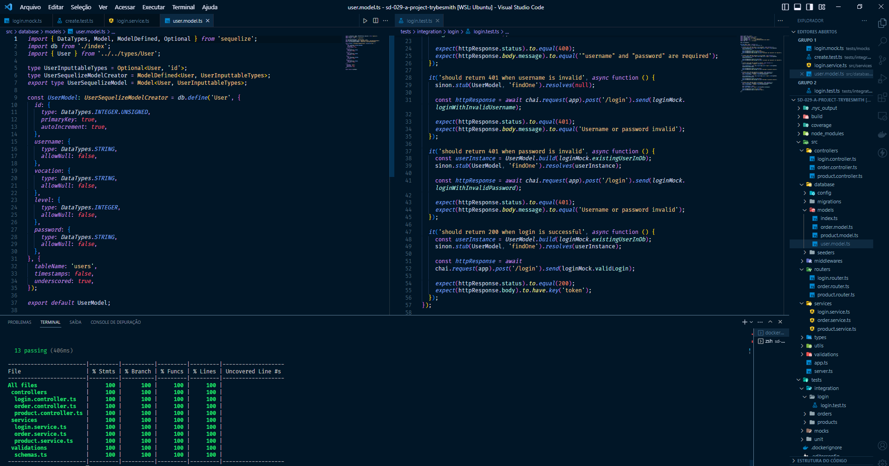
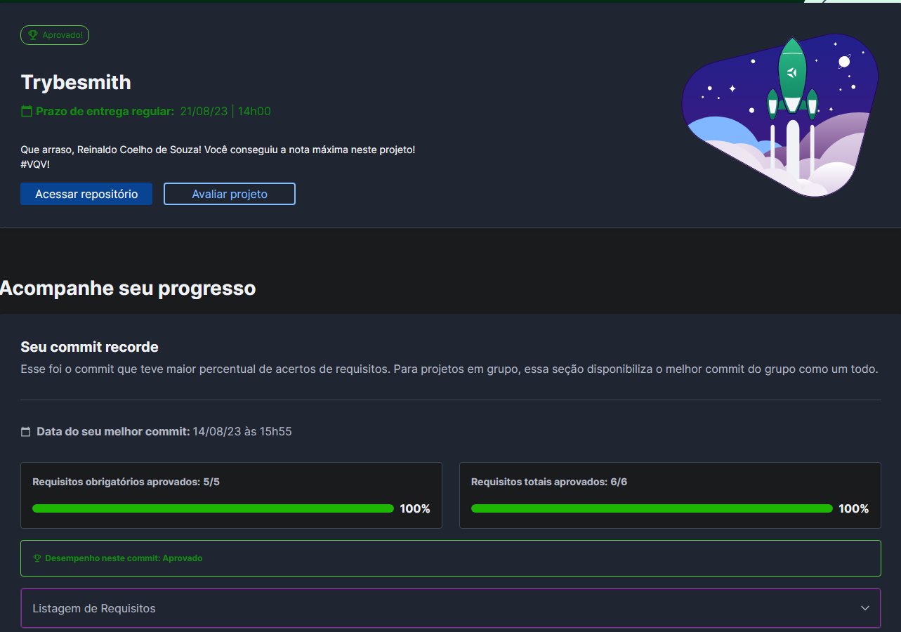

# ⚔ Trybesmith

## 📘 Sobre

Desenvolvi uma loja de itens medievais no formato de uma API utilizando TypeScript e Sequelize. Criei as camadas model, service e controller da aplicação, utilizei JWT para autenticar algumas rotas e realizei testes que garantem o funcionamento correto da aplicação. Os endpoints incluem suporte para operações de criação, leitura e atualização de informações.

## ⚛️ Ferramentas

- Sequelize;
- JWT (Jason Web Token);
- Node.js;
- Express.js;
- TypeScript;
- Mocha, Chai e Sinon;
- MySQL;
- Middlewares;
- Arquitetura em camadas (model, service e controller);
- Docker;

## 🛠️ Como executar o projeto?

1. Suba os containers da aplicação com `docker-compose up -d`.
2. Abra o terminal do container `docker exec -it trybesmith_api bash`.
3. Inicie o servidor `npm run dev`.

## 📝 Nota

